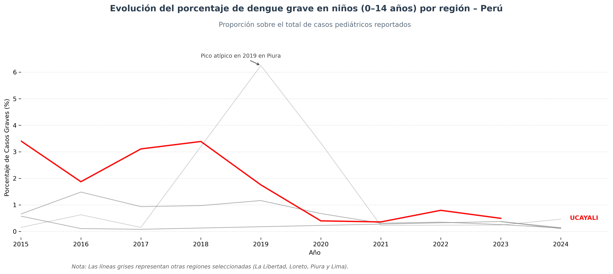

# Casos de Dengue en Niños en Perú (2015-2024)

## 📋 Descripción del Proyecto

Este proyecto fue desarrollado como parte de la asignación final *"Becoming an Independent Data Scientist"* del curso **Applied Plotting, Charting & Data Representation in Python** parte del programa **Data Science with Python** de la Universidad de Michigan (Coursera).

El objetivo es analizar la evolución de los casos de dengue grave en población pediátrica (0-14 años) en las principales regiones de Perú, utilizando datos públicos de vigilancia epidemiológica del Ministerio de Salud.

## 🎯 Pregunta de Investigación

**¿Cómo ha evolucionado la proporción de casos graves de dengue entre niños (0-14 años) en las regiones más afectadas de Perú a lo largo del tiempo?**

Esta pregunta surge de la necesidad de comprender los patrones regionales de severidad del dengue en población infantil, considerando que las formas graves de la enfermedad son de especial preocupación en salud pública.

## 📊 Fuentes de Datos

### Dataset Principal
- **Fuente**: [Vigilancia Epidemiológica de Dengue - Datos Abiertos Perú](https://www.datosabiertos.gob.pe/dataset/vigilancia-epidemiológica-de-dengue)
- **Periodo**: 2008-2024
- **Filtrado aplicado**: 2015-2024, población de 0-14 años
- **Formato**: CSV con separador punto y coma (;)
- **Variables clave**: 
  - Año de notificación
  - Departamento
  - Edad y tipo de edad (días, meses, años)
  - Diagnóstico CIE-10 (A97.2 para dengue grave)

## 🔍 Metodología

### Procesamiento de Datos

1. **Filtrado temporal**: Selección de casos entre 2015-2024
2. **Normalización de edad**: Conversión de edad a años desde días, meses y años
3. **Filtrado etario**: Inclusión únicamente de casos pediátricos (≤14 años)
4. **Agregación regional**: Agrupación por año y departamento
5. **Identificación de regiones principales**: Selección de los 5 departamentos con mayor incidencia
6. **Cálculo de proporciones**: Porcentaje de casos graves (A97.2) sobre total de casos

### Visualización

La visualización principal utiliza un **gráfico de líneas** que muestra:

- **Eje X**: Años (2015-2024)
- **Eje Y**: Porcentaje de casos graves (%)
- **Líneas**: Cada línea representa una región
- **Énfasis visual**: Ucayali resaltado en rojo por tener el mayor promedio de casos graves
- **Anotación**: Identificación del pico atípico en Piura (2019)



## 💡 Hallazgos Principales

1. **Piura**: Presenta un pico atípico alrededor de 2019, sugiriendo un evento excepcional (posiblemente brote epidémico) más que una tendencia sostenida

2. **Ucayali**: Mantiene la proporción más alta y sostenida de casos graves a lo largo del periodo, destacándose consistentemente sobre otras regiones

3. **Lima y otras regiones**: Exhiben proporciones más bajas y estables en el tiempo

4. **Variabilidad regional**: Existen diferencias notables entre regiones, lo que sugiere factores locales (acceso a servicios, circulación de serotipos, etc.) que influyen en la severidad

## 🎨 Principios de Diseño (Cairo)

La visualización fue diseñada siguiendo los principios de Alberto Cairo:

### 1. **Truthfulness (Verdad)**
- Uso de **proporciones** en lugar de números absolutos para permitir comparaciones justas entre regiones con diferentes tamaños poblacionales
- Visualización directa de los datos sin manipulaciones que distorsionen la realidad
- Escala consistente en el eje Y

### 2. **Functionality (Funcionalidad)**
- Gráfico de líneas apropiado para mostrar tendencias temporales
- Código de color efectivo: rojo para destacar la región con mayor proporción promedio
- Anotación estratégica del pico atípico en Piura para facilitar interpretación

### 3. **Beauty (Belleza)**
- Diseño limpio y minimalista con mínimo "chartjunk"
- Paleta de colores sobria: rojo para énfasis, grises para contexto
- Grid discreto para facilitar lectura de valores

### 4. **Insightfulness (Insight)**
- Permite identificar fácilmente patrones temporales, anomalías y contrastes regionales
- La visualización responde directamente la pregunta de investigación
- Facilita la generación de hipótesis sobre eventos epidemiológicos

## 🛠️ Tecnologías Utilizadas

- **Python 3.x**
- **pandas**: Procesamiento y análisis de datos
- **numpy**: Operaciones numéricas y transformaciones
- **matplotlib**: Generación de visualizaciones
- **seaborn**: Mejoras estéticas en visualizaciones

## 📁 Estructura del Proyecto

```
casos-dengue-peru/
│
├── data/
│   └── datos_abiertos_vigilancia_dengue_2008_2024.csv
│
├── dengue.ipynb                                    # Notebook principal con análisis
├── dengue_grave_pediatrico_departamentos_top.png   # Visualización final
└── README.md                                        # Este archivo
```

## 🚀 Cómo Ejecutar

1. **Clonar el repositorio**:
   ```bash
   git clone https://github.com/danyneyra/casos-dengue-peru.git
   cd casos-dengue-peru
   ```

2. **Instalar dependencias**:
   ```bash
   pip install pandas numpy matplotlib seaborn
   ```

3. **Abrir el notebook**:
   ```bash
   jupyter notebook dengue.ipynb
   ```

4. **Ejecutar las celdas** en orden secuencial

## 📝 Notas Adicionales

- El código A97.2 del CIE-10 corresponde a **Dengue Grave** (anteriormente "dengue hemorrágico")
- Los datos están sujetos a reportes y pueden tener variaciones según la capacidad de vigilancia de cada región
- El análisis se centra en población pediátrica por ser un grupo vulnerable de especial interés en salud pública

## 👤 Autor

**Dany Neyra**

- GitHub: [@danyneyra](https://github.com/danyneyra)

## 📄 Licencia

Este proyecto se desarrolló con fines educativos como parte del programa **Data Science with Python** de la Universidad de Michigan.

Los datos utilizados son de acceso público y están disponibles en el portal de Datos Abiertos del Gobierno de Perú.

---

*Proyecto desarrollado en Diciembre de 2025*
